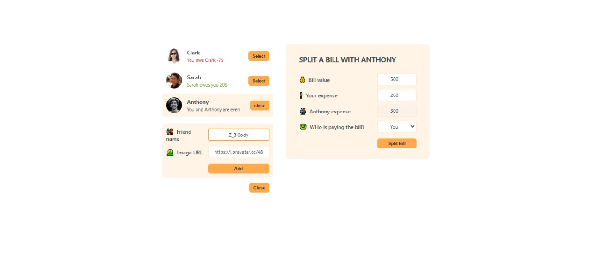

# Eat-n-Split

Eat-n-Split is a React application that helps you split bills with your friends. You can add friends, track balances, and split expenses easily.

## Features

- **Add Friends**: Add friends with their names and profile pictures.
- **Track Balances**: Keep track of who owes whom and how much.
- **Split Bills**: Split expenses between you and your friends.

## Project Structure

The main components of the application include:

- **App**: The root component that manages the state and renders other components.
- **FriendList**: Displays a list of friends and their balances.
- **Friend**: Represents an individual friend with their balance and selection functionality.
- **FormSplitBill**: A form to split bills between you and a selected friend.
- **AddFriend**: A form to add new friends to the list.
- **Button**: A reusable button component.

## Getting Started

### Prerequisites

- Node.js (v14 or later)
- npm or yarn

### Installation

1. Clone the repository:

   ```bash
   git clone https://github.com/ZBl0ody/eat-n-split
   ```

2. Navigate to the project directory:

   ```bash
   cd eat-n-split
   ```

3. Install dependencies:

   ```bash
   npm install
   ```

### Running the Application

Start the development server:

```bash
npm start
```

The application will be available at `http://localhost:3000`.

## Usage

1. Add friends using the "Add Friend" button.
2. Select a friend from the list to split a bill.
3. Enter the bill amount, your expense, and choose who is paying.
4. Click "Split Bill" to update the balances.

## Screenshot

Below is a screenshot of the application:



> **Note**: Replace `screenshot.png` with an actual screenshot of your application. Save the screenshot in the `public` folder of your project.

## Technologies Used

- React
- JavaScript
- CSS

## Folder Structure

```
starter/
├── public/          # Static assets (e.g., screenshot.png)
├── src/             # Source code
│   ├── component/   # React components
│   ├── App.jsx      # Main application file
│   ├── index.css    # Global styles
│   └── index.js     # Entry point
└── README.md        # Project documentation
```

## License

This project is for educational purposes and is part of the "ReactJS - Jonas" course.

## Acknowledgments

- Inspired by the "ReactJS - Jonas" course.
- Profile pictures generated using [Pravatar](https://pravatar.cc/).
